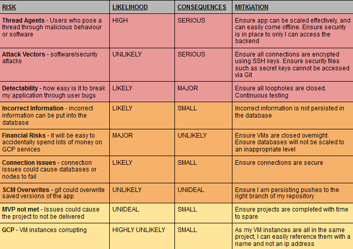

# CSGOBUYGENERATOR

## Brief

The DevOps Practical project is designed to showcase my knowledge from the DevOps fundamental course, as well as my ability to operate as a dev-ops engineer. This project focuses on the CI pipeline in order to test, build and deploy applications automatically.

## Requirements

The Minumum Viable Product for this project is a fully complete CI/CD pipeline, integrated into a version control system utilising different branches for different versions. The application must be built utilising a microservice architechture, with at least 4 services. These are:

    Service 1: Connect all services persisting data in an SQL database
    Service 2+3: Generate a "random" object 
    Service 4: Generate an object that is built based on the objects generated previously

## Scope

* A Kanban board.
* An Application fully integrated using the Feature-Branch model into a Version Control System, built through a CI server and deployed to a cloud-based virtual machine.
* If a change is made to a code base, then Webhooks should be used so that Jenkins recreates and redeploys the changed application
* The app must follow a micro-service architecture.
* The project must be deployed using containerisation and an orchestration tool.
* Create an Ansible Playbook to deploy environments.
* The project must make use of a reverse proxy to make your application accessible to the user.

## Platform Specific Benefits

    Kanban Board: Jira - easy to track tasks, free
    Version Control: Git - open source, easy to use
    CI Server: Jenkins - Capable of all the tasks needed for automation, runs everything centrally
    Configuration Management: Ansible - allows configuration of environments to be scripted
    Cloud server: GCP virtual machines - free, easy to connect
    Containerisation: Docker - open source, easy to use
    Orchestration Tool: Docker Swarm - works well with docker to stack images and deploy
    Reverse Proxy: NGINX - works well with docker swarm as a load balancer&reverse proxy

## Jira

Using Jira as a Kanban board allowed me to easily plan, track and complete tasks

## Chosen Idea: Counter Strike Buy Generator 

On refreshing the page the user is shown a new buy:

Service 1: Page which connects all the services in a HTML file and saves buys into a database

Service 2: Generates a random weapon, and a buy strength for that weapon.

Service 3 : Generates a strategy, and a strength for a the strategy.

Service 4 : Generates a round strength based on buy and strategy.

A second implementation has generated an eco-buy weapon and CT strategy

## Risk Assessment

Original risk assessment  
  

Updated risk assessment  
 

## Database ED

A simple table was used to persist data from my app into a database. This then allowed me to show previous generated objects.

## CI Pipeline

The main goal of this project was to create a robust CI pipeline system, capabale of performing rolling updates with little to no downtime. As such, scripting methods were used with jenkins order to test, build and deploy the app. As versions are pushed onto the main hub of my github repository, a webhook automatically triggers, and imports the build to my jenkins server. Jenkins then automatically runs pytest, pushes generated images to dockerhub, and configures environments using Ansible. Ansible will then deploy the stack to a docker-swarm machine. The user only connects to nginx:80, and never connects to my app architechture which improves security.

My jenkinsfile automatically runs a script which tests, builds and deploys my app.

## Testing

There were issues with testing my core-service. Due to the way I designed my apps, there was more than one route operating within each microservice, which made it difficult when using mock tests on the home page. As such, my core service only achieved a coverage of 74%. This has been offset by my other microservices, which have achieved 93%, 90% and 94%. 

  
  
  

## Frontend

The frontend to my application is a simple jinja2 script that returns a generated object upon refresh and saves it into a database.

## Improvements

Currently my application uses more than one microservice per container. Also, in some modules such as my strategy backend, I was unable to properly deploy replica containers due to the use of global variables. This severly impacted the robust-ness of my continuous deployment, as I was not able to properly persist rolling updates without some issues and downtime. However, if left alone, the app will bring up the new build successfuly.

## Author

Naail Choudhury

## Aknowledgements

Harry Volker: Guidance and teaching throughout the course  
Max Pattman: Help troubleshooting issues  
Brenan Kirbky: Help troubleshooting issues  
